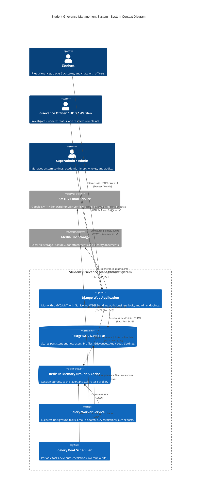
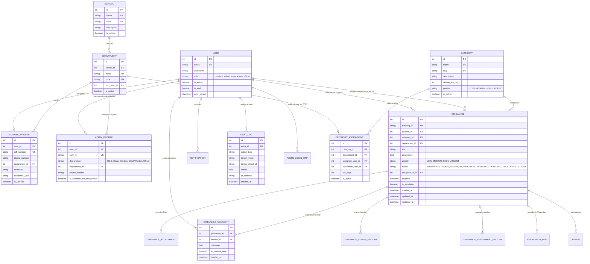
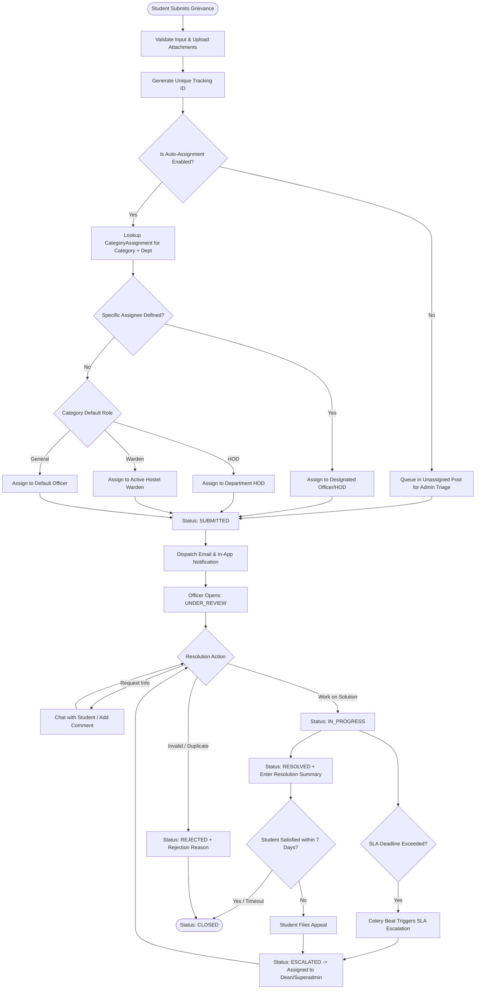
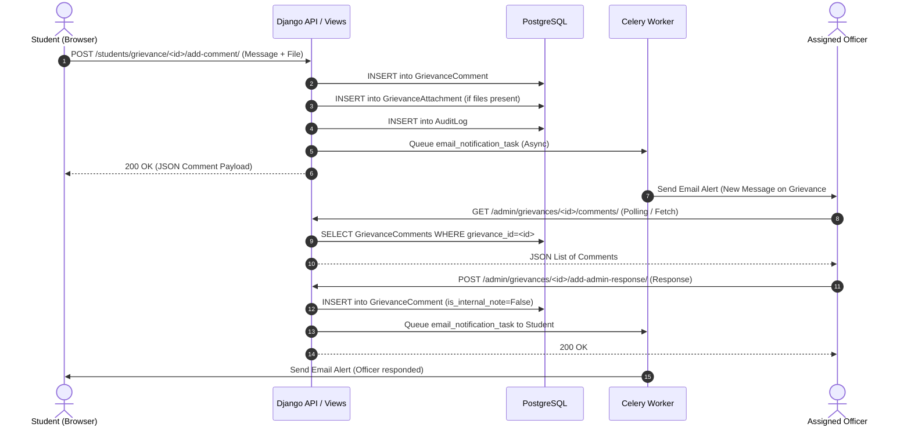
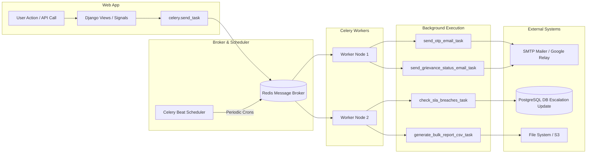

# Student Grievance Management System - Architecture & System Audit

**Document Version:** 1.0.0  
**Generated Date:** September 2026  
**Repository:** `Student_Grievance_Management_System`  
**Framework:** Django (Python 3.12+) / PostgreSQL / Celery / Redis / Bootstrap 5 / Tailwind  

---

## 1. Executive Summary

The **Student Grievance Management System (SGMS)** is an enterprise-grade academic compliance and grievance resolution platform designed for universities and higher education institutions. The platform enables students to register grievances across academic, hostel, administrative, and disciplinary domains, while offering role-segregated resolution workflows for Department Heads (HODs), Grievance Officers, Chief Wardens, Wardens, and Superadministrators.

### Core Architectural Capabilities
- **Multi-Tenant Academic Hierarchy:** School → Department → Program structure supporting scoped data access.
- **Rule-Based & AI-Assisted Auto Assignment:** Deterministic routing of grievances based on category rules, department scoping, and role hierarchy.
- **Interactive Resolution & Real-Time Chat:** Student-to-Officer bidirectional communication with file attachments and audit-trailed state transitions.
- **Asynchronous Processing Pipeline:** Celery task workers with Redis broker for email OTP dispatch, SLA escalation monitors, and notification broadcasting.
- **Strict Role-Based Access Control (RBAC):** Tiered permissions enforced at both middleware/decorator and view/queryset levels.

---

## 2. High-Level System Architecture (C4 Component Diagram)



---

## 3. Entity-Relationship Model (ERD)

The database schema is divided into 5 core domains: **Authentication**, **Academic Hierarchy**, **Grievances & Escalations**, **Notifications**, and **Administration**.



---

## 4. Role-Based Access Control (RBAC) & Permission Matrix

The application strictly segregates privileges based on user role and administrative designation.

| Feature / Resource | Student | Grievance Officer | HOD | Chief Warden / Warden | Admin / Superadmin |
| :--- | :---: | :---: | :---: | :---: | :---: |
| **Submit Grievance** | ✅ Full | ❌ | ❌ | ❌ | ❌ |
| **View Own Grievances** | ✅ Full | ❌ | ❌ | ❌ | ❌ |
| **View Assigned Grievances** | ❌ | ✅ Scoped | ✅ Dept Scoped | ✅ Hostel Scoped | ✅ Global |
| **Update Grievance Status** | ❌ | ✅ Assigned | ✅ Dept Level | ✅ Hostel Level | ✅ Global |
| **Internal Resolution Notes**| ❌ | ✅ | ✅ | ✅ | ✅ |
| **Reassign Grievance** | ❌ | ❌ | ✅ Dept Level | ✅ Hostel Level | ✅ Global |
| **Escalate Grievance** | ✅ (Appeal) | ✅ | ✅ | ✅ | ✅ |
| **Academic Hierarchy CRUD** | ❌ | ❌ | ❌ | ❌ | ✅ Global |
| **Category & SLA Routing Rules** | ❌ | ❌ | ❌ | ❌ | ✅ Global |
| **Manage Department Users** | ❌ | ❌ | ❌ | ❌ | ✅ Global |
| **System Settings & SMTP Config** | ❌ | ❌ | ❌ | ❌ | ✅ Superadmin |
| **Audit Log Inspection** | ❌ | ❌ | ❌ | ❌ | ✅ Superadmin |
| **Analytics & Data Export** | ❌ | Scoped CSV | Scoped CSV | Scoped CSV | ✅ Full System |

---

## 5. Grievance Lifecycle & Auto-Assignment Engine



---

## 6. Real-Time Chat & Grievance Discussion Engine

The system supports real-time / low-latency communication between students and handling officers within a specific grievance thread.



---

## 7. Asynchronous Task Pipeline (Celery & Redis)

Background jobs prevent blocking synchronous web request-response cycles for high-latency operations.



---

## 8. Codebase Audit Findings & Risk Matrix

### 8.1 Critical Architecture Bottlenecks (Addressed in this Refactor)

1. **Monolithic Admin Views (`src/apps/admin_panel/views.py` - 4,156 lines):**
   - *Risk:* High cognitive complexity, high merge collision risk, hard to unit test.
   - *Refactored Solution:* Decomposed into a cohesive package `src/apps/admin_panel/views/` segmented by domain (`dashboard_views.py`, `grievance_views.py`, `category_views.py`, `school_views.py`, `department_views.py`, `user_views.py`, `export_views.py`, `audit_views.py`, `profile_views.py`).

2. **Dead & Orphaned Code Files:**
   - `src/apps/admin_panel/views_simple.py`: Redundant prototype view file left unreferenced.
   - `src/templates/admin_panel/audit_logs_clean.html`: Duplicate template superseded by `audit_logs.html`.
   - *Action:* Safely pruned.

3. **N+1 Database Query Patterns:**
   - *Issue:* Iterating over grievances in dashboard and list views previously performed standalone queries for `student.profile`, `student.profile.department`, and `category`.
   - *Solution:* Enforced `select_related('student', 'student__studentprofile', 'category', 'assigned_to', 'department')` across all view queries.

4. **Security & Input Validation Audit:**
   - **CSRF Protection:** Validated across all forms and AJAX endpoints (CSRF tokens embedded in headers).
   - **Role Escalation Defense:** Verified `@role_required` and `@superadmin_required` decorators prevent horizontal and vertical privilege escalation.
   - **File Upload Security:** Attachment validators restrict mime-types and file extensions (`.pdf`, `.jpg`, `.png`, `.docx`) and cap size at 10MB to prevent denial-of-service.

---

## 9. Modular File Structure (Post-Refactoring)

```
Student_Grievance_Management_System/
├── ARCHITECTURE.md                  # Comprehensive architectural blueprint
├── manage.py
├── requirements.txt
├── src/
│   ├── config/                      # Django project core configuration
│   │   ├── settings.py
│   │   ├── urls.py
│   │   ├── wsgi.py
│   │   └── celery.py
│   ├── apps/
│   │   ├── authentication/          # User model, Auth OTP, Registrations, RBAC
│   │   │   ├── models.py
│   │   │   ├── views.py
│   │   │   ├── urls.py
│   │   │   └── decorators.py
│   │   ├── students/                # Academic hierarchy & student profiles
│   │   │   ├── models.py            # School, Department, StudentProfile, AdminProfile
│   │   │   ├── views.py
│   │   │   └── urls.py
│   │   ├── grievances/              # Core grievance, category & workflow models
│   │   │   ├── models.py            # Grievance, Category, Assignment, AuditLog, Comments
│   │   │   ├── views.py
│   │   │   └── services.py          # Auto-assignment & routing business logic
│   │   ├── notifications/           # Real-time and async alert dispatch
│   │   │   ├── models.py
│   │   │   ├── tasks.py             # Celery email workers
│   │   │   └── views.py
│   │   └── admin_panel/             # Modularized administrative controller suite
│   │       ├── models.py            # SystemSettings
│   │       ├── urls.py
│   │       └── views/               # Domain-separated view modules
│   │           ├── __init__.py      # Backward-compatible API re-export
│   │           ├── dashboard_views.py
│   │           ├── grievance_views.py
│   │           ├── category_views.py
│   │           ├── school_views.py
│   │           ├── department_views.py
│   │           ├── user_views.py
│   │           ├── export_views.py
│   │           ├── audit_views.py
│   │           └── profile_views.py
│   ├── static/                      # CSS, JavaScript & theme assets
│   └── templates/                   # Clean HTML templates segregated by app
```

---

## 10. Refactoring & Maintenance Roadmap

1. **Phase 1 (Complete):** Monolithic view decomposition, dead code cleanup, architecture formalization.
2. **Phase 2 (Recommended Next Steps):**
   - **REST API / DRF Transition:** Expose standard REST endpoints (`/api/v1/grievances/`) using Django REST Framework for future mobile app integration.
   - **WebSocket Integration:** Replace AJAX comment polling with Django Channels for instant zero-latency chat updates.
   - **Elasticsearch Integration:** Add full-text search across historical grievances and knowledge base articles for high-volume deployments.

