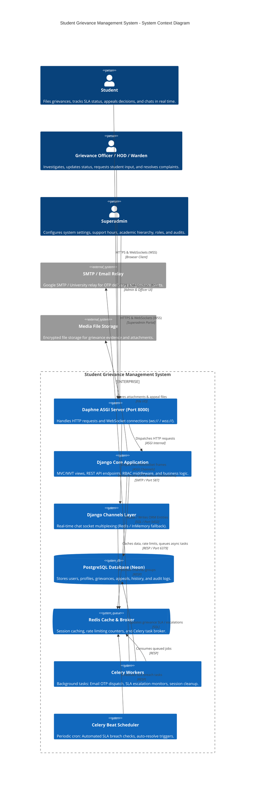
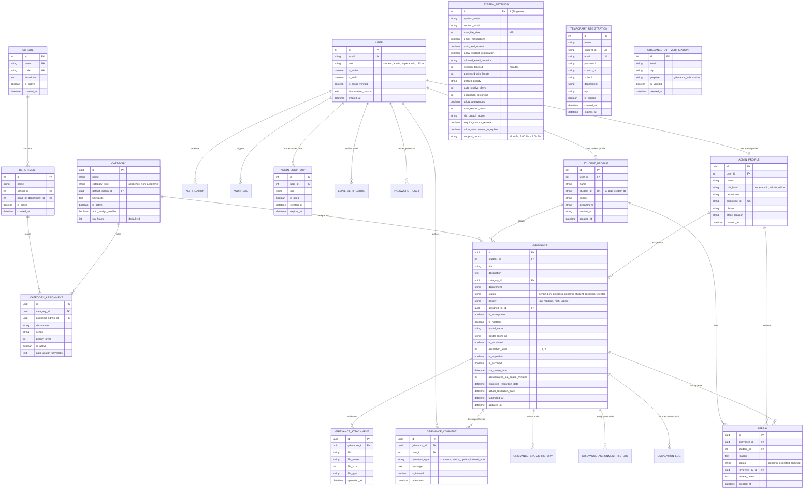
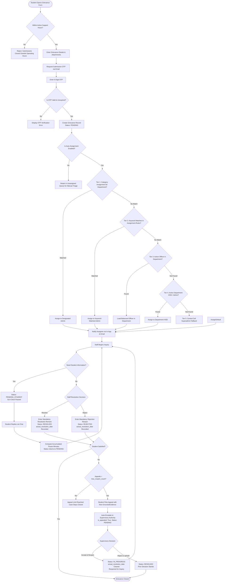

# Student Grievance Management System - Architecture & System Blueprint

**Document Version:** 2.0.0  
**Updated Date:** September 2026  
**Repository:** `Student_Grievance_Management_System`  
**Git Branch:** `beta`  
**Framework:** Django 5.2+ (Python 3.12+) / Daphne ASGI / Channels 4.2+ / PostgreSQL (Neon) / Redis / Celery / Bootstrap 5  

---

## 1. Executive Summary

The **Student Grievance Management System (SGMS)** is an institutional-grade academic compliance and dispute resolution platform designed for universities, colleges, and higher education institutes. The platform enables students to lodge formal grievances across academic, hostel, administrative, and disciplinary domains, while providing role-segregated resolution workflows for Department Heads (HODs), Grievance Officers, Chief Wardens, Wardens, and Superadministrators.

### Core Architectural Capabilities
- **Multi-Tenant Academic Hierarchy:** School → Department → Program structure with self-healing HOD auto-assignment (`Department.auto_assign_hod_if_needed`).
- **5-Tier Deterministic Auto-Assignment Engine:** Intelligently routes grievances based on (1) Department Category Assignments, (2) Title/Description Keywords, (3) Officer Load Balancing, (4) Department HOD Fallback, and (5) Central Cell Superadmin Fallback.
- **Interactive Resolution & Real-Time WebSocket Chat:** Daphne ASGI-powered bi-directional chat threads with file attachment validations, live status badge synchronization, and audit logging.
- **Dynamic SLA & Pause Clock:** Priority multipliers (Urgent: 25%, High: 50%, Medium: 100%, Low: 150%); automatic SLA pausing when status is `pending_student` and resumption upon student response.
- **Student Right of Appeal:** Formal appeal lodging on resolved/rejected grievances up to `max_reopen_count` times, with supervisory re-examination.
- **Support Hours Governance:** Configurable operational schedules (e.g. `Mon-Fri, 9:00 AM - 5:00 PM`, `24/7`, overnight schedules) strictly gating new submissions and student replies.
- **Permanent Dual-Factor OTP Verification:** Mandatory email OTP verification for student self-registration (`TemporaryRegistration`) and grievance lodgment (`GrievanceOTPVerification`).
- **Strict Role-Based Access Control (RBAC) & Security:** HMAC-SHA256 server-secret staff 2FA, brute-force lockout tracking, idle session termination, and department data scoping.

---

## 2. High-Level System Architecture (C4 Component Diagram)



---

## 3. Entity-Relationship Model (True Schema)



---

## 4. Role-Based Access Control (RBAC) & Boundary Matrix

| Feature / Resource | Student | Grievance Officer | Department Admin / HOD | Superadmin |
| :--- | :---: | :---: | :---: | :---: |
| **Self-Registration (OTP)** | ✅ Full | ❌ (Admin-provisioned) | ❌ (Admin-provisioned) | ❌ (Admin-provisioned) |
| **2FA Staff Login (HMAC)** | ❌ (Direct) | ✅ Required | ✅ Required | ✅ Required |
| **Lodge Grievance** | ✅ Full (Subject to Support Hours) | ❌ | ❌ | ❌ |
| **Anonymous Grievance Lodgment** | ✅ (If enabled in settings) | ❌ | ❌ | ❌ |
| **View Own Grievances** | ✅ Full | ❌ | ❌ | ❌ |
| **View Assigned Grievances** | ❌ | ✅ Assigned Only | ✅ Department Scoped | ✅ University-wide |
| **Update Grievance Status** | ❌ | ✅ Assigned Only | ✅ Department Scoped | ✅ University-wide |
| **Mandatory Closure Remarks** | ❌ | ✅ Enforced | ✅ Enforced | ✅ Enforced |
| **Internal Staff Notes** | ❌ Hidden | ✅ Visible/Writable | ✅ Visible/Writable | ✅ Visible/Writable |
| **Reassign Grievances** | ❌ | ❌ | ✅ Within Department | ✅ Global |
| **Lodge Appeal** | ✅ Up to `max_reopen_count` | ❌ | ❌ | ❌ |
| **Review & Process Appeal** | ❌ | ❌ | ✅ Level 1 Review | ✅ Level 2 Review |
| **Academic Hierarchy CRUD** | ❌ | ❌ | ❌ | ✅ Full CRUD |
| **Manage Department Users** | ❌ | ❌ | ✅ Dept Students & Officers | ✅ Full CRUD |
| **System Settings & Support Hours**| ❌ | ❌ | ❌ | ✅ Full Configuration |
| **Audit Log Inspection** | ❌ | ❌ | ❌ | ✅ Full Audit Trail |
| **CSV Data Export** | ❌ | ✅ Scoped CSV | ✅ Scoped CSV | ✅ Full University CSV |

---

## 5. Grievance Lifecycle & Auto-Assignment Engine



---

## 6. Real-Time Communication & SLA Management Engine

### Real-Time Chat Engine (Daphne / Django Channels)
1. **Zero-Latency Streaming:** When a student or officer submits a message or file attachment, the event is persisted to the database and broadcasted via the Django Channels layer (`f'chat_{grievance.id}'`).
2. **Dynamic Live Badges:** State transitions triggered by staff automatically broadcast updated status badges, updating student browsers without page refreshes.
3. **Internal Note Security:** Comments flagged as `is_internal=True` are restricted to staff and stripped from student payloads.

### SLA Calculation & Background Processing
1. **Priority-Weighted SLA Calculation:**
   $$\text{Effective SLA Hours} = \max\left(\text{Category Base SLA} \times \text{Multiplier}, 6\right)$$
   where $\text{Urgent}=0.25$, $\text{High}=0.50$, $\text{Medium}=1.00$, and $\text{Low}=1.50$.
2. **Business Hours Weekend Shift:** When breach deadlines fall on a weekend (Saturday/Sunday), the breach deadline is automatically shifted forward to Monday morning.
3. **Background Cron (`process_slas`):** Executed regularly by Celery Beat to auto-resolve stale cases (`auto_resolve_days`) and escalate breached Level 0 / Level 1 grievances.

---

## 7. Modular Codebase Structure

```
Student_Grievance_Management_System/
├── ARCHITECTURE.md                  # Comprehensive architectural blueprint
├── README.md                        # Project documentation and quickstart
├── pyproject.toml / uv.lock         # Dependency management
├── manage.py
├── src/
│   ├── config/                      # Django & Daphne core configuration
│   │   ├── asgi.py                  # Daphne ASGI router (HTTP + Channels WebSocket)
│   │   ├── wsgi.py                  # WSGI fallback application
│   │   ├── settings.py              # Dynamic configuration & test cache isolation
│   │   ├── urls.py                  # Top-level routing
│   │   └── celery.py                # Celery async worker & Beat setup
│   ├── apps/
│   │   ├── authentication/          # User auth, 2FA, OTP verification, security utils
│   │   │   ├── models.py            # User, TemporaryRegistration, AdminLoginOTP
│   │   │   ├── security_utils.py    # Failed login tracking, HMAC OTP verification
│   │   │   ├── middleware.py        # SessionTimeoutMiddleware
│   │   │   ├── views.py             # Login, registration, OTP verify
│   │   │   └── tests/               # Authentication test suite
│   │   ├── students/                # Academic hierarchy & student experience
│   │   │   ├── models.py            # School, Department (auto-HOD), StudentProfile, AdminProfile
│   │   │   ├── views.py             # Student dashboard, profile, grievances, appeals
│   │   │   └── tests/               # Students test suite
│   │   ├── grievances/              # Core grievance domain, routing & SLA
│   │   │   ├── models.py            # Grievance, Category, Assignment, Comments, Appeal
│   │   │   ├── tasks.py             # Celery SLA escalation worker
│   │   │   ├── consumers.py         # WebSocket live chat consumer
│   │   │   ├── api_views.py         # DRF GrievanceViewSet & CategoryViewSet
│   │   │   ├── views.py             # Submit grievance, OTP verify, track view
│   │   │   ├── management/commands/
│   │   │   │   └── process_slas.py  # SLA check & auto-resolution cron command
│   │   │   └── tests/               # Grievance domain test suite
│   │   ├── admin_panel/             # Domain-segregated administrative views
│   │   │   ├── models.py            # SystemSettings singleton
│   │   │   ├── support_hours.py     # Operating hours parser & validator
│   │   │   ├── superadmin_views.py  # Superadmin settings, all-users CRUD, audit logs
│   │   │   ├── views/               # Decomposed controller suite
│   │   │   │   ├── dashboard_views.py
│   │   │   │   ├── grievance_views.py
│   │   │   │   ├── user_views.py
│   │   │   │   ├── export_views.py
│   │   │   │   └── crud_views...
│   │   │   └── tests/               # Admin panel test suite
│   │   └── notifications/           # In-app and async email notifications
│   │       ├── models.py            # Notification, ReadNotification
│   │       ├── tasks.py             # Celery email workers
│   │       └── tests/               # Notifications test suite
│   ├── static/                      # CSS, JavaScript & theme assets
│   └── templates/                   # Clean HTML templates
```
